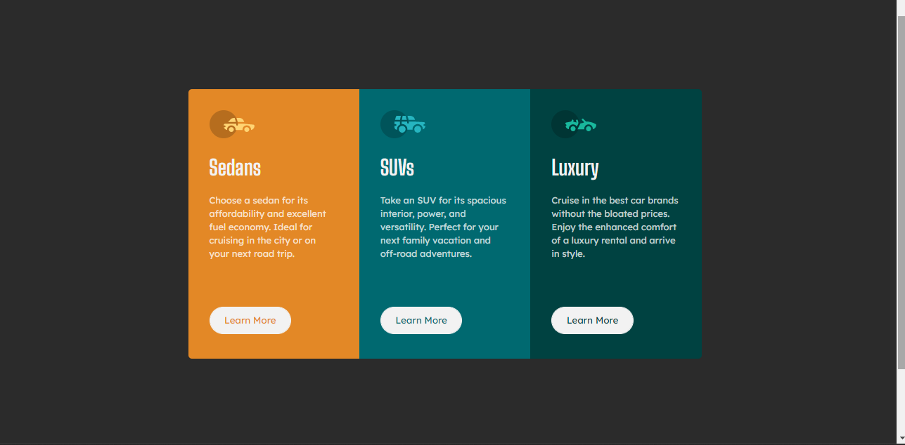

# Frontend Mentor - 3-column preview card component solution by Maame

This is a solution to the [3-column preview card component challenge on Frontend Mentor](https://www.frontendmentor.io/challenges/3column-preview-card-component-pH92eAR2-). Frontend Mentor challenges help you improve your coding skills by building realistic projects. 

## Table of contents

- [Overview](#overview)
  - [The challenge](#the-challenge)
  - [Screenshot](#screenshot)
  - [Links](#links)
- [My process](#my-process)
  - [Built with](#built-with)
  - [What I learned](#what-i-learned)
  - [Continued development](#continued-development)
  - [Useful resources](#useful-resources)
- [Author](#author)

## Overview

### The challenge

Users should be able to:

- View the optimal layout depending on their device's screen size
- See hover states for interactive elements

### Screenshot

- Solution URL: [Maame's 3-Column Preview Card solution](https://mbonamensa.github.io/fem_3-column-preview-card)
- Live Site URL: [Frontend Mentor | 3-Column Preview Card by Maame](https://mbonamensa.github.io/fem_3-column-preview-card)
- Figma file: [I created my own figma file](https://www.figma.com/file/i9c0GEh9Dg1nvkwk4g4ewE/Frontend-Mentor---3-column-Preview-Card?node-id=0%3A1)

## My process

### Built with

- Semantic HTML5 markup
- CSS custom properties
- Flexbox
- CSS Grid

### What I learned

I practiced my CSS grids skills. I usually like to use flexbox all the time because I felt it was the safer option.
It was fun using grids in this project and practicing how to use it with flexbox. 

### Continued development

I'm not closing my mind to grids anymore, I am going to use them together with flexbox in future projects when need be.

## Author

- Website - [Maame Yaa Serwaa Bona-Mensa](https://mbonamensa.netlify.app)
- Frontend Mentor - [@mbonamensa](https://www.frontendmentor.io/profile/mbonamensa)
- Twitter - [@mys_bm](https://www.twitter.com/mys_bm)
